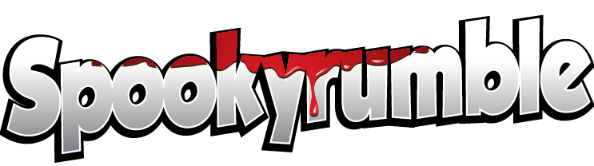

# Welcome to My GitHub

### About Me

Hello! My name is **Hans**, also known as **Spookyrumble**. At 41, I've embarked on a journey into Front-End Development, reigniting a long-dormant passion for coding. With a diverse background ranging from working on fishing boats to being a service coordinator, I'm now pursuing my dream in the tech world. I'm excited to share my projects and learnings with you!

### What's New

[ **Interactive Game**](https://github.com/Spookyrumble/Flutter-game): Check out a Pong-like game I built using Flutter.

[ **Discord Bot**](https://github.com/Spookyrumble/AdLing): A fun project that pulls job listings from a website and posts them to a Discord server.

[ **E-Com app**](https://github.com/Spookyrumble/React-eCom): My first introduction to building with React. Styled with Styled-Components.
[Live Demo](https://areactecom.netlify.app/).

[ **Auction app**](https://github.com/Spookyrumble/Auction): An Auction site built using Bootstrap and SASS. This project also has Jest Unit testing and E2E testing.
[Live Demo](https://areactecom.netlify.app/).

[ **Social Media app**](https://github.com/Spookyrumble/css-frameworks-ca): A Social Media site built using Bootstrap and SASS.
[Live Demo](https://css-framework-js2.netlify.app/).

🌐 **Latest School Projects**: Currently exploring React, Vite, and Tailwind CSS. Stay tuned for updates post-exams!

### Skills & Tools

### Featured Projects

I'm proud to showcase projects that I've designed, developed, and programmed during my first year as a student.

#### Year One School Projects

A new portfolio is being made with the new projects.
The following projects have had their backend discontinued, therefore the deployments have been removed.

🔗 [Explore My Year One Portfolio](https://spookyrumble-portfolio.netlify.app)

- **Rainydays**: A year-long evolving e-commerce project.  
  [GitHub](https://github.com/HMAsp/HTML-CSS_CA_HMA_2022) | _Live Demo has been taken down._
- **CSM**: Integrates lessons from our first semester into a text-heavy project.  
  [GitHub](https://github.com/HMAsp/2022-12-16_semester_project1_HMAsp) | _Live Demo has been taken down._
- **Beer Recipes**: Our first foray into JavaScript and APIs.  
  [GitHub](https://github.com/HMAsp/hma_js1_ca) | _Live Demo has been taken down._

- **Inside the Trip**: A capstone project that includes advanced features like custom comment sections and POST contact forms.  
  [GitHub](https://github.com/Noroff-FEU-Assignments/project-exam-1-HMAsp) | _Live Demo has been taken down._

### Contributing

I welcome contributions to my school projects! If you'd like to collaborate or tweak the code, please submit a pull request for review.

### Contact Me

Feel free to reach out via any of the platforms below:

- 📧 mailspooky@yahoo.com
- 🐦 [Twitter](https://twitter.com/HansMarAnd)
- 🔗 [LinkedIn](https://www.linkedin.com/in/hma1982/)
- 🐙 [GitHub](https://github.com/HMAsp)
